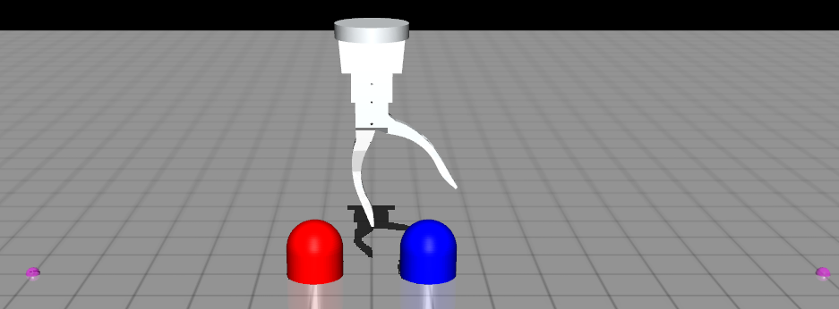
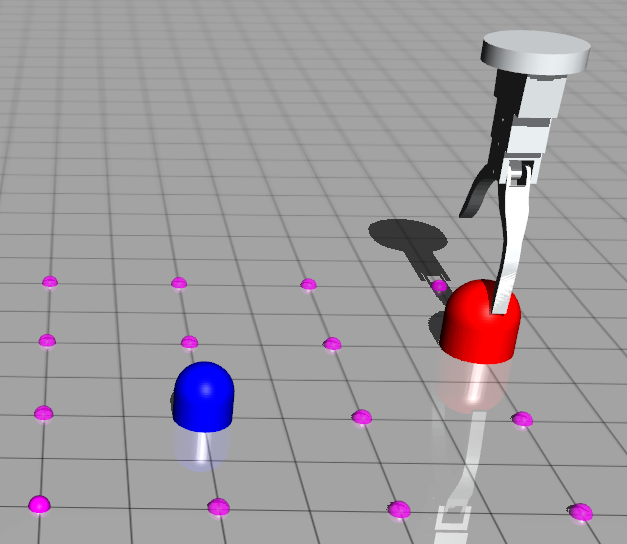
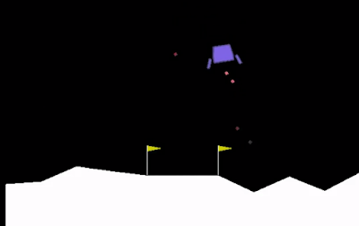
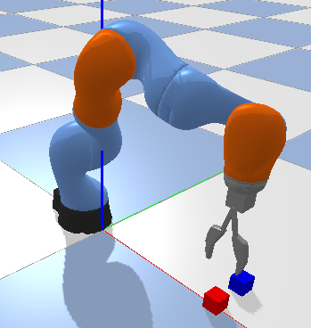

This is the repo that store domains used in [Leveraging Fully Observable Policies for Learning under Partial Observability](https://openreview.net/pdf?id=pn-HOPBioUE) accepted at CoRL 2022. See descriptions of these domains in the paper.

### Setup
- Install `pip3 install -e .`
- You will need to install https://github.com/hai-h-nguyen/pomdp_robot_domains to run Block-Picking

### Domains
- Car-Flag: A car must go to the green flag (which can be on either side with equal prob.). The car is given the direction of the green flag when it is close to the blue flag. It is given a penalty when it goes to the red flag.

<p align="center">
  
</p>

- Bumps-1D

<p align="center">
  
</p>

- Bumps-2D

<p align="center">
  
</p>

- LunarLander-P or -V

<p align="center">
  
</p>

- Block-Picking: The agent has to pick on block up from two blocks using colorless depth images. Only one block is pickable and the agent does not know which one. In the current version of the domain, the positions of the blocks are fixed but they switch their positions randomly. To test the domain, run tests/test_block_picking.py. This script will run an expert which know exactly which block to pick.

<p align="center">
  
</p>

### Test experts
- Run the files in the tests folder

### Cite
If you use this repo in your published work, please cite as


```
@article{nguyen2022leveraging,
  title={Leveraging Fully Observable Policies for Learning under Partial Observability},
  author={Nguyen, Hai and Baisero, Andrea and Wang, Dian and Amato, Christopher and Platt, Robert},
  journal={arXiv preprint arXiv:2211.01991},
  year={2022}
}
```
