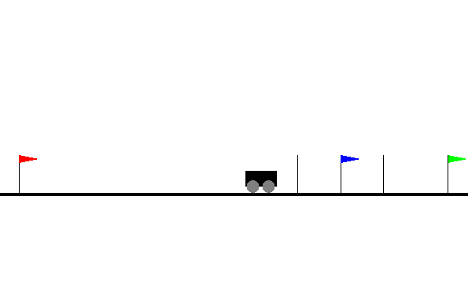

This is the repo that store several pomdp domains that I use for my research.

### Setup
- Install `pip3 install -e .`
- You will need MuJoCo to run for all domains except for Car-Flag

### Domains
- Car-Flag-1D: A car must go to the green flag (which can be on either side with equal prob.). The car is given the direction of the green flag when it is close to the blue flag. It is given a penalty when it goes to the red flag.

  

