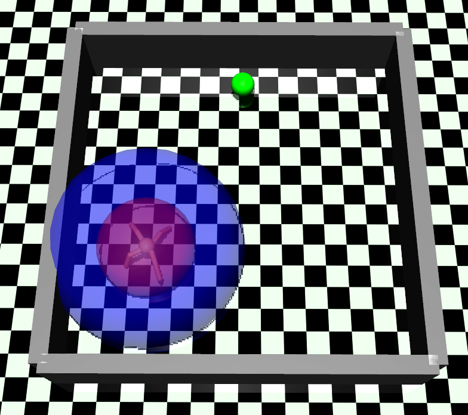
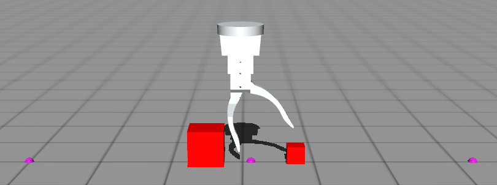
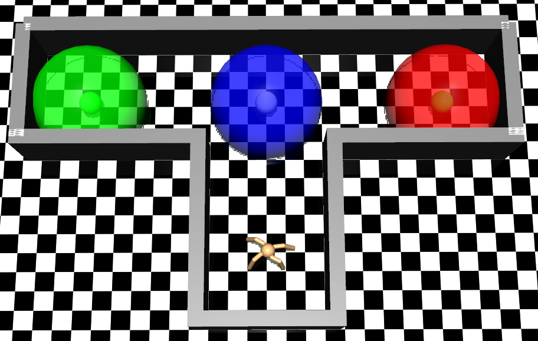

This is the repo that store several pomdp domains that I use for my research.

### Setup
- Install `pip3 install -e .`
- You will need MuJoCo to run for all domains except for Car-Flag

### Domains
- Car-Flag: A car must go to the green flag (which can be on either side with equal prob.). The car is given the direction of the green flag when it is close to the blue flag. It is given a penalty when it goes to the red flag.

<p align="center">
  
</p>

- Ant-Tag: An ant must move close enough to an opponent which tends to move away from the ant. The ant does not usually observe the opponent's position except when the opponent is within the blue sphere.

<p align="center">
  
</p>

- Two-Boxes: Using the history of angles and positions, the finger must check the sizes of two boxes to see if they are equal. If yes, it goes to the right to finish the task, else go to the left.

<p align="center">
  
</p>

- Ant-Heaven-Hell: Similar to Car-Flag but in 2D, the ant must go to the green area whose side are given when it is within the blue sphere. It is given a penalty when it goes to the red area.

<p align="center">
  
</p>

### Cite
If you use this repo in your published work, please cite as


```
@misc{nguyen2021penvs,
  author={Hai, Nguyen},
  title={Pomdp Robot Domains},
  year={2021},
  publisher={GitHub},
  journal={GitHub repository},
  howpublished={\url{https://github.com/hai-h-nguyen/pomdp-domains}},
}
```
